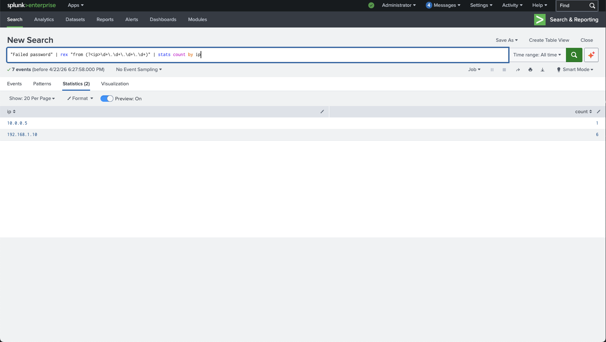

# SOC Analyst Lab – Brute Force Attack Detection (Splunk)

## Overview

This project simulates a Security Operations Center (SOC) investigation detecting a brute force attack using Splunk SIEM.

## Objective

Identify suspicious authentication activity and determine if a brute force attack is occurring.

## Data Source

* Linux authentication logs (`auth.log`)
* Ingested into Splunk Enterprise

## Detection Logic

```spl
"Failed password"
| rex "from (?<ip>\d+\.\d+\.\d+\.\d+)"
| stats count by ip
| sort -count
```

## Investigation Process

1. Ingested log data into Splunk
2. Searched for repeated failed login attempts
3. Extracted attacker IP addresses using regex
4. Aggregated login attempts by IP
5. Identified abnormal behavior

## Findings

* **192.168.1.10** → 6 failed login attempts (suspicious)
* **10.0.0.5** → 1 failed attempt (normal)

## Analysis

The repeated login failures from a single IP indicate a likely brute force attack targeting SSH access.

## Mitigation Recommendations

* Block malicious IP addresses
* Implement account lockout policies
* Enable multi-factor authentication (MFA)
* Monitor authentication logs continuously

## Evidence



## Skills Demonstrated

* SIEM (Splunk)
* Log analysis
* Threat detection
* Regex field extraction
* Security investigation workflow
